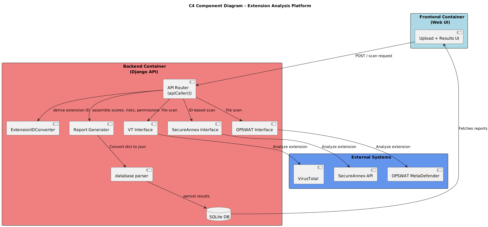

# DV1512-CETRA-Codebase

The fullstack code base for the software security project in DV1512.

The goal of this project is to develop an app that analyzes Chrome extensions, to detect potential malicious behavior.

## System Architecture
High-level view of the system components and their interactions:

## Threat Model
Threat modeling made in ThreatDragon for the system:

## Dependencies
- Linux OS (either by default, WSL or a virtual machine)
- Pip installed
- requirements.txt

## Prerequisites
The application relies on external malware analysis APIs and an AI module.
To enable these integrations, create a .env file (based on .env.example) and provide valid API keys:

- VirusTotal API key: https://www.virustotal.com
- OPSWAT MetaDefender API key: https://id.opswat.com/login
- SecureAnnex API key: https://app.secureannex.com/login
- Google Gemini API key (AI module): https://aistudio.google.com/app/api-keys

Make sure all required API keys are inserted before running the system, as several components depend on them.

## User Guide: How to Use CETRA

### 1. Initial Setup & Authentication
Follow these steps to install, configure, and access the application:
1. **Install Requirements**: In your terminal, run `pip install -r requirements.txt`.
2. **Migrate Database**: Run `python manage.py migrate` to apply changes to the database.
3. **Run Tests (Optional)**: Run `python manage.py test` to ensure the system is stable.
4. **Create User**: Execute `python manage.py createsuperuser --username=joe --email=joe@example.com` to create a user in the Django database.
    - Follow the terminal instructions.
    - Bypass password strength validation when prompted.
5. **Start Server**: Run `python manage.py runserver` to launch the program.
    - Open your browser to the localhost address (usually http://127.0.0.1:8000).
    - Log in with the credentials you entered during the `createsuperuser` step.
6. **Security Note**: For security, too many incorrect login attempts will trigger a temporary lockout with a 60-second countdown before you can try again.

### 2. Navigation & Themes
Once authenticated, use the navigation bar to access different modules.
* **Tabs**: Navigate between **Home**, **History**, **Settings**, and **MITRE ATT&CK**.
* **Themes**: In the **Settings** tab, you can toggle between **Light Mode** and **Dark Mode**.
* **Logout**: Use the logout button to securely end your session.

### 3. Submitting an Extension for Analysis
The **Home** page serves as the primary analysis hub.
* **Analysis Options**: You can submit an extension using a valid **Chrome Web Store ID**, or by uploading a **ZIP** or **CRX** file.
* **Duplicate Detection**: If a report for the extension already exists from the last 30 days, the system will allow you to either **Open the Existing Report** or **Run a New Analysis**.
* **Analysis Time**: After clicking **Submit**, a loading spinner will appear. The process typically takes around three minutes.
* **Results**: The homepage also displays the **Top 5 Highest Scores** found in the system.
* **Prerequisite for MITRE**: You must first submit an extension via the **Home** page (using ID or file upload) for a standard analysis before you can perform a MITRE analysis.

### 4. Reviewing Reports & Analytics
* **Detailed Reports**: Click on a result to see the **Verdict**, **Threat Score**, requested **Permissions**, and a breakdown of **Findings** by malware family and category.
* **History Tab**: View all previous searches, complete with pagination to browse through items.
* **Data Export**: In the History tab, you can download your analysis results as a **JSON** file.
* **MITRE ATT&CK**: This tab allows you to perform deeper behavioral mapping. You can view the status of a report as **Not Started**, **Completed**, or **Not Available**. Once completed, you can view specific **Tactics** and **Techniques** detected in a sandbox environment.

