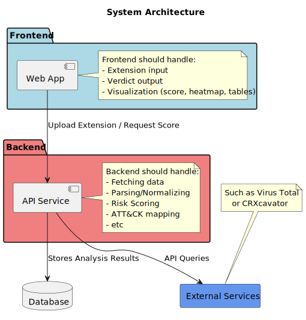

# DV1512-CETRA-Codebase

The fullstack code base for the software security project in DV1512.

The goal of this project is to develop an app that analyzes Chrome extensions, to detect potential malicious behavior.

## System Architecture
High-level view of the system components and their interactions:



## Threat Model
Threat modeling made in ThreatDragon for the system:


## Dependencies
- Linux OS (either by default, WSL or a virtual machine)
- Pip installed
- requirements.txt

### Django instructions 

#### Install requirements.txt, in terminal:
``` bash
pip install -r requirements.txt
```

#### To run the tests, in terminal:
``` bash
python manage.py test
```

#### To create a user run, in terminal: 
``` bash
python manage.py createsuperuser --username=joe --email=joe@example.com
```

#### To run the program, in terminal:
```
python manage.py runserver
```
#### To complete program setup:
- Follow the terminals instructions.
- Bypass password strength validation.
- Open localhost website
- Log in with the user created.


