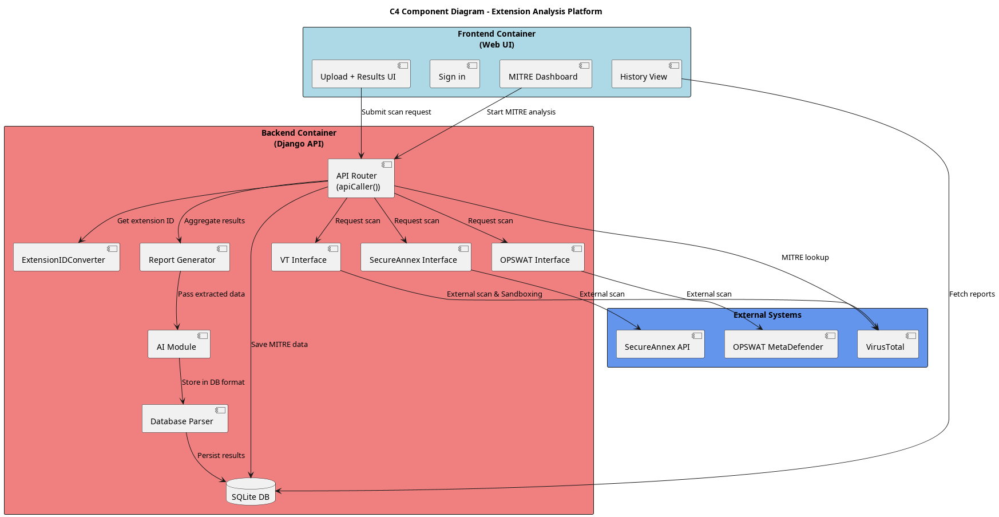

## Architecture Diagram

The following diagram shows the high-level component architecture of CETRA,
including the frontend container, backend services, database, and external
analysis systems.

The architecture diagram was created using PlantUML and follows a C4-style
component diagram approach.
